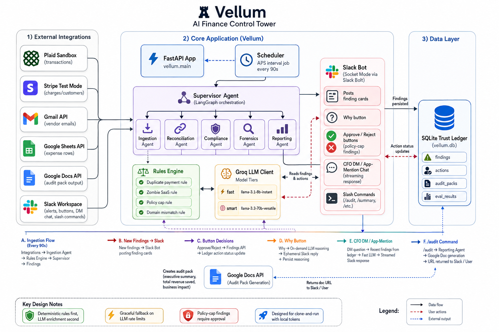

# Vellum

Vellum is an always-on AI finance controller for SMB/startup teams. It monitors Plaid, Stripe, Gmail, and Google Workspace, detects fraud/duplicate/policy issues, pushes actionable findings to Slack, and generates audit-ready summaries in Google Docs.

## Architecture



## Project overview

- **Ingest + detect:** Scheduler-driven ingestion collects transactions/emails/expense rows and runs deterministic rules (duplicate, zombie SaaS, policy-cap, domain mismatch).
- **Agent orchestration:** A supervisor coordinates reconciliation, compliance, forensics enrichment, and reporting.
- **Slack-first operations:** Findings are posted as cards with `Why` and approval actions, plus CFO DM/app-mention chat for quick questions.
- **Trust ledger:** Findings/actions are persisted in SQLite for traceability, approvals, and reporting.
- **Audit output:** `/audit` generates a Google Doc with executive summary, total revenue saved, and business impact.

## 💰 Business Impact

> **A 50-person startup loses an average of $47,000 per year to financial leakage. Vellum catches it automatically, every 90 seconds, at $199/month.**

### The Problem

Most early-stage startups cannot afford a full-time financial controller.
The result is a predictable set of losses that compound quietly:

- **Duplicate payments** go unnoticed for weeks because nobody is cross-referencing invoices against bank statements manually.
- **Zombie SaaS subscriptions** accumulate as teams grow and tools get forgotten; the average startup pays for 3-5 unused tools at any given time.
- **Expense policy violations** slip through because manual spot-checks cover maybe 20% of submissions.
- **Vendor fraud** succeeds because a convincing email requesting a bank account update looks legitimate to a busy founder.

These are not edge cases. They are the default operating condition of many companies between 10 and 200 employees.

---

### What Vellum Recovers

| Problem | Average Annual Loss | How Vellum Catches It |
|---|---|---|
| Duplicate payments | $12,000 | Same vendor, +/-2% amount, within 7-day window; flagged within 90 seconds |
| Zombie SaaS | $15,000 | Recurring charge + zero employee activity in 30 days |
| Policy violations | $8,000 | Every expense checked against policy, 100% coverage |
| Vendor wire fraud | $12,000+ per incident | Sender domain cross-referenced against verified vendor registry |
| **Total** | **$47,000+/year** | **Caught autonomously, zero manual review** |

---

### Time Recovered

| Task | Before Vellum | After Vellum |
|---|---|---|
| Quarterly audit prep | 3 weeks of controller time | 10 seconds via one slash command |
| Duplicate payment review | Discovered weeks later, if at all | 90 seconds after second charge lands |
| Expense report compliance | Manual spot-check, ~20% coverage | 100% of submissions reviewed automatically |
| Vendor fraud detection | Discovered after wire clears | Flagged before approval |
| Monthly reconciliation | 2-3 days per month | Continuous, automated |

---

### ROI

```text
Vellum cost:          $199/month  ->  $2,388/year
Average leakage caught:            $47,000/year
------------------------------------------------
Net recovery in year one:          $44,612
Return on investment:              20x
```

A part-time bookkeeper may cost ~$2,000/month and still rely on manual review.
Vellum runs continuously, catches rule-detectable issues across transactions/emails/expenses, and attaches an evidence trail to each finding.

---

### Revenue Per Employee Impact

Traditional finance operations at a 50-person startup often consume:

- 1 part-time controller or bookkeeper ($24,000-$48,000/year)
- significant quarterly audit-prep time
- ongoing founder attention on approvals and disputes

Vellum automates routine detection/documentation, so finance effort shifts to high-judgment work:
fundraising, modeling, and investor reporting.

---

### The Risk Case

- Average cost of a successful vendor wire fraud at an SMB can reach **$130,000**.
- Recovery rates after fraudulent wires are often low.
- Vellum's vendor-domain mismatch detection at **$199/month** can pay for years of usage from one prevented incident.

---

### Market Opportunity

| Segment | Count | ARR at $199/month |
|---|---|---|
| US SMBs with 10-50 employees | 2.8 million | $6.7 billion |
| US SMBs with 50-200 employees | 1.6 million | $3.8 billion |
| **Total addressable market** | **4.4 million** | **$10.5 billion** |

Capturing 1% of this market at $199/month implies ~$105M ARR potential.

---

### Pricing

| Plan | Price | Who it's for |
|---|---|---|
| Starter | $199/month | Up to 50 employees, 3 integrations |
| Growth | $499/month | Up to 200 employees, all integrations, multi-user approvals |
| Enterprise | Custom | 200+ employees, custom policy rules, dedicated support |

---

### Built in 5 Hours

Vellum was built by a two-person team in a 5-hour hackathon using Cursor, LangGraph, Groq, and Snyco automation.

> *"The controller a 50-person startup can't afford to hire - for $199/month."*

## Quickstart (clone and run)

### 1) Clone and install

```bash
git clone <your-repo-url>
cd vellum
python3 -m venv .venv
source .venv/bin/activate
pip install -e .
```

### 2) Configure environment

```bash
cp .env.example .env
```

Fill in `.env` with your own values:

- `GROQ_API_KEY`
- `SLACK_BOT_TOKEN`
- `SLACK_APP_TOKEN`
- `PLAID_CLIENT_ID`
- `PLAID_SECRET`
- `STRIPE_API_KEY`
- `GOOGLE_CREDENTIALS_PATH`

How to get each value:

- `GROQ_API_KEY`
  - Go to [Groq Console](https://console.groq.com/keys).
  - Create an API key.
  - Put it in `.env` as:
    - `GROQ_API_KEY=...`

- `SLACK_BOT_TOKEN`
  - Go to [Slack API Apps](https://api.slack.com/apps) -> your app -> **OAuth & Permissions**.
  - Install/Reinstall app to workspace.
  - Copy **Bot User OAuth Token** (`xoxb-...`).
  - Put it in `.env`:
    - `SLACK_BOT_TOKEN=xoxb-...`

- `SLACK_APP_TOKEN`
  - In Slack app settings -> **Basic Information** -> **App-Level Tokens**.
  - Create token with `connections:write` scope.
  - Copy token (`xapp-...`).
  - Put it in `.env`:
    - `SLACK_APP_TOKEN=xapp-...`

- `PLAID_CLIENT_ID` and `PLAID_SECRET`
  - Go to [Plaid Dashboard](https://dashboard.plaid.com/).
  - Use Sandbox credentials from Team Settings / API Keys.
  - Put in `.env`:
    - `PLAID_CLIENT_ID=...`
    - `PLAID_SECRET=...`
    - `PLAID_ENV=sandbox`

- `STRIPE_API_KEY`
  - Go to [Stripe Dashboard](https://dashboard.stripe.com/apikeys).
  - Use a **test** secret key (`sk_test_...`) for demos.
  - Put it in `.env`:
    - `STRIPE_API_KEY=sk_test_...`

- `GOOGLE_CREDENTIALS_PATH`
  - Create/download a local Google credential JSON file (OAuth user token JSON or service account JSON) with required scopes used by this app.
  - Save the file inside your local repo (recommended: `./secrets/google_token.json`, and keep it gitignored).
  - Put path in `.env`:
    - `GOOGLE_CREDENTIALS_PATH=./secrets/google_token.json`

Local file placement checklist:

- Keep secrets only in your local checkout:
  - `.env`
  - Google credential JSON file (path referenced by `GOOGLE_CREDENTIALS_PATH`)
- Do not commit these files to git.

Defaults that usually work as-is:

- `PLAID_ENV=sandbox`
- `VELLUM_DB_PATH=./vellum.db`
- `VELLUM_POLICY_PATH=./data/policy.md`

### 3) Start the app

```bash
.venv/bin/python -m uvicorn vellum.main:app
```

You should see:

- `scheduler.started`
- `slack.socket_mode.started`
- `Bolt app is running!`

### 4) (Optional) Run the live demo seeder

```bash
PYTHONPATH=. .venv/bin/python data/seed/live_demo_four_issues.py --reset-ledger
```

This seeds 4 scenarios and posts findings to Slack:

- Plaid recurring Datadog (zombie SaaS signal)
- Stripe duplicate Acme charges
- Gmail vendor-domain mismatch scenario
- Google Sheet policy-cap violation

## Slack usage

- Findings post to `SLACK_FINANCE_ALERTS_CHANNEL`.
- `Why` button returns LLM reasoning (with fallback when quota is exhausted).
- `Approve/Reject` appears for policy-cap findings.
- DM or mention the bot for CFO chat, for example:
  - `What's the most urgent thing you found today?`
- Run audit pack generation in Slack with:
  - `/audit last_30_days`
  - `/audit 2026-05`

### `/audit` Slack command

What it does:

- Triggers audit-pack generation via the app API.
- Returns a Google Doc URL when ready.

Examples:

- `/audit` -> defaults to `last_30_days`
- `/audit last_30_days`
- `/audit 2026-05` (year-month period)

## Slack app requirements

In your Slack app config:

- **Socket Mode** enabled
- **App Home**:
  - Messages tab enabled
  - "Allow users to send messages" enabled
- **Event Subscriptions** bot events include:
  - `app_mention`
  - `message.im`
- **Slash Commands**:
  - create `/audit`
  - request URL should point to your app endpoint if using HTTP mode
  - for this Socket Mode setup, keep the command configured in app + scopes and the Bolt handler will process it
- **OAuth scopes** include at least:
  - `chat:write`
  - `im:read`
  - `im:history`
  - `commands`

After changing scopes/events, reinstall the app to workspace.
